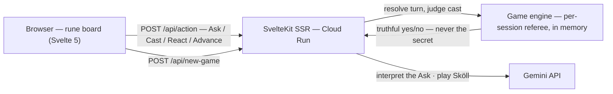

<h1 align="center">☀️ Save the Sun</h1>

<p align="center"><em>A deduction race against Sköll, the wolf who hunts the sun — name the hidden rune before he does.</em></p>

<p align="center">
  Built for the DEV 2026 June Solstice Challenge.<br/>
  Canonical design spec lives under <a href="./docs/"><code>docs/</code></a>; see <a href="AGENTS.md"><code>AGENTS.md</code></a> for AI agent rules.
</p>

<p align="center">
  
  
  <br/>
  
  
</p>

<p align="center">
  
</p>

## Table of Contents

- [About](#about)
- [Play](#play)
- [Features](#features)
- [Tech Stack](#tech-stack)
- [Architecture](#architecture)
- [Project Structure](#project-structure)
- [Getting Started](#getting-started)
- [Configuration](#configuration)
- [Security](#security)
- [How to Contribute](#how-to-contribute)
- [What's Next](#whats-next)
- [License](#license)
- [Acknowledgements](#acknowledgements)
- [Author](#author)

---

## About

It's the eve of the longest day, and the dawn must be earned. Twenty-four runes stand; one is the solstice offering. You question the Oracle in plain English, cross runes off by hand, and cast your answer before Sköll names it first. The deduction is rigorous and deterministic — every round is provably winnable through legal Asks alone, and the Oracle never lies — but it's wrapped in a night-to-dawn ritual instead of a logic grid. The night visibly advances as turns pass; the moon sets; dawn gathers at the edge of the world.

Design intent: [`docs/prd.md`](docs/prd.md) · mechanics: [`docs/game-spec.md`](docs/game-spec.md) · voice: [`docs/ux-copy.md`](docs/ux-copy.md).

---

## Play

- **Live:** [savethesun.anchildress1.dev](https://savethesun.anchildress1.dev/)
- Desktop-first; the embedded board plays down to 750px wide. Below that, the rite asks for a wider sky.

---

## Features

| Feature            | What it does                                                                                                                                                                                                                 |
| ------------------ | ---------------------------------------------------------------------------------------------------------------------------------------------------------------------------------------------------------------------------- |
| Free-text Asks     | Type a yes/no question — group, range, light/dark, hue, or a single rune. Gemini interprets it, echoes its reading, and the engine answers truthfully. Refusals (negation, mixed types, secret-fishing) don't cost the turn. |
| The Cast           | Naming the rune is a separate, armed action — deliberate, sacred, and uninterruptible. Right wins the round; wrong wastes only the turn.                                                                                     |
| Sköll              | The wolf runs his own deduction over the same board and races you to the rune. His asks are visible; his reasoning isn't.                                                                                                    |
| Scry & Hex         | One-use reactions to his Ask: Scry steals his answer, Hex silences the Oracle and wastes his turn. He holds the same charges against you.                                                                                    |
| The night advances | Every turn slides the painted moon toward the horizon while dawn gathers at the header's edge. Win and the sun rises; lose and the night never breaks.                                                                       |
| Resume on reload   | A refresh resumes the same round — same secret, same board order, same crossings, same voiced Oracle line. In-memory only; no accounts, no database.                                                                         |
| Accessibility      | Whole round playable by keyboard, axe-clean across surfaces (WCAG 2.1 AA), screen-reader narration via status regions, reduced-motion respected.                                                                             |
| Honest degradation | With all mood graphics and audio failed or off, the game remains fully playable and fair on the plain grid.                                                                                                                  |

---

## Tech Stack

- **App:** [SvelteKit 2](https://svelte.dev/docs/kit) / Svelte 5 (runes), TypeScript, Node.js ≥ 26, ESM
- **AI:** [Gemini API](https://ai.google.dev/) (`@google/genai`) — interprets Asks for the Oracle and plays Sköll
- **Tests:** Vitest (unit + browser-mode component), Playwright e2e, `@axe-core/playwright`, Lighthouse CI (pre-push)
- **Quality:** ESLint, Prettier, svelte-check, commitlint (conventional + RAI), secretlint, Lefthook hooks
- **CI/CD:** GitHub Actions (CI, CodeQL, Release Please), SonarCloud, Docker → Google Cloud Run

---

## Architecture



The engine holds the secret rune and referees every turn; Gemini only ever interprets language and plays the wolf. The board order, the round token, and the secret live server-side per session — a reload resumes, a new game reshuffles.

Deeper diagrams — turn flow, the voice Live + tool-call loop, and the session lifecycle — live in [`docs/architecture.md`](docs/architecture.md).

---

## Project Structure

```
src/
  lib/
    components/        # RuneGrid, RuneCard, Onboarding, EndScreen, ReactionPrompt
    server/
      engine/          # deterministic referee: state, queries, reactions, session registry
      oracle/          # Gemini-backed Oracle — interprets a free-text Ask, answers truthfully
      skoll/           # the wolf: his deduction floor, his asks, his Gemini prompt
    assets-webp/       # banners, rune art, UI chrome
    styles/            # theme tokens (midnight navy + ritual gold)
  routes/
    +page.svelte       # the rite: header, board, Oracle panel
    api/action/        # one POST for Ask / Cast / React / Advance
    api/new-game/      # fresh secret, fresh layout
docs/                  # design spec, mechanics, rune data, voice & copy, test plan
tests/                 # unit + component (vitest browser) + e2e (playwright, axe)
```

---

## Getting Started

```bash
git clone git@github.com:anchildress1/save-the-sun.git
cd save-the-sun
make install                 # pnpm install + playwright browsers
cp .env.example .env         # then add your GEMINI_API_KEY
make dev                     # vite dev server
```

- `make preview` — serve the real production build (the asset pipeline `make dev` skips)
- `make test` — unit + component suite with coverage
- `make e2e` — Playwright end-to-end (builds and serves the prod bundle first)
- `make ai-checks` — format, lint, typecheck, test, build; the full validation gate

---

## Configuration

| Variable         | Required | What it does                                                                                                |
| ---------------- | -------- | ----------------------------------------------------------------------------------------------------------- |
| `GEMINI_API_KEY` | Yes      | Server-side only — powers the Oracle and Sköll. Get one at [AI Studio](https://aistudio.google.com/apikey). |

Local secrets live in `.env` (gitignored). Deployed, the key rides Google Secret Manager via [`deploy.sh`](deploy.sh).

---

## Security

- The secret rune never enters gameplay responses, the client bundle, or the public board seed — the engine alone holds and judges the answer, and Gemini prompts are secret-free by construction (the model interprets language and plays the wolf). The always-on `/debug` stream is the one deliberate exception: it names the secret because following the engine's truth live is its whole point — a spoiler surface by design.
- `GEMINI_API_KEY` is server-side only: `.env` locally, Secret Manager on Cloud Run. It can never enter the `/debug` stream — every logged string is masked at the sink, and tests assert it.
- Sessions are an `httpOnly`, `secure`, `sameSite=lax` cookie holding an opaque UUID — no user data, no accounts, nothing durable.
- `secretlint` runs in the pre-commit hook; CodeQL runs in CI.

---

## How to Contribute

- Branch off `main`; PRs only — nothing lands direct.
- Conventional Commits enforced by commitlint (with the RAI plugin — AI-assisted commits carry attribution footers).
- Lefthook runs format, lint, and secret-scan pre-commit; Lighthouse a11y/perf gates pre-push.
- `make ai-checks` green before you push. Treat warnings as errors, because the linters do.

---

## What's Next

- **v2 — the Oracle speaks:** voice via the Gemini Live API — wake the Oracle, ask aloud, barge-in allowed. Spec'd in [`docs/v2-implementation-checklist.md`](docs/v2-implementation-checklist.md).
- Sköll escalation taunts wired to how close he is.

---

## License

[Polyform Shield 1.0.0](LICENSE) — read it, run it, learn from it, fork it for fun. The one thing you can't do is take the wolf and sell him against us; "shield" means exactly what it sounds like. Not an OSI license, on purpose.

---

## Acknowledgements

- The [DEV](https://dev.to/) June Solstice Challenge, for the deadline-shaped motivation.
- [Gemini](https://ai.google.dev/) plays both the Oracle and the wolf without ever being trusted with the referee's job.
- The Elder Futhark, for 24 runes with better lore than any invented alphabet.
- Footer icons: [simple-icons](https://simpleicons.org/), [Font Awesome Free](https://fontawesome.com/) (CC BY 4.0), [Feather](https://feathericons.com/).

---

## Author

**Ashley Childress**

[](https://anchildress1.dev) [](https://github.com/anchildress1) [](https://dev.to/anchildress1) [](https://linkedin.com/in/anchildress1)
