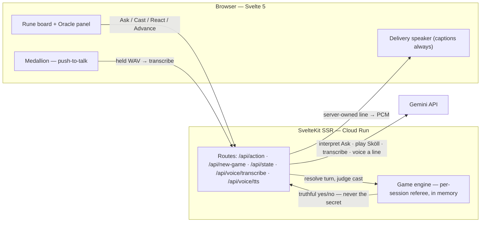

<h1 align="center">☀️ Save the Sun</h1>

<p align="center"><em>A deduction race against Sköll, the wolf who hunts the sun — name the hidden rune before he does.</em></p>

<p align="center">
  Built for the DEV 2026 June Solstice Challenge.<br/>
  Canonical design spec lives under <a href="./docs/"><code>docs/</code></a>; see <a href="AGENTS.md"><code>AGENTS.md</code></a> for AI agent rules.
</p>

<p align="center">
  
  
  <br/>
  
  
  
</p>

<p align="center">
  
</p>

## Table of Contents

- [About](#about)
- [AI & Prizes](#ai--prizes)
- [Play](#play)
- [Features](#features)
- [Tech Stack](#tech-stack)
- [Architecture](#architecture)
- [Project Structure](#project-structure)
- [Getting Started](#getting-started)
- [Configuration](#configuration)
- [Security](#security)
- [How to Contribute](#how-to-contribute)
- [What's Next](#whats-next)
- [License](#license)
- [Acknowledgements](#acknowledgements)
- [Author](#author)

---

## About

It's the eve of the longest day, and the dawn must be earned. Twenty-four runes stand; one is the solstice offering.

- **Deduction-as-ritual, not a logic grid** — question the Oracle in plain English, cross runes off by hand, and **Cast** before Sköll names the rune first. Every round is provably winnable through legal Asks alone, and the Oracle never lies.
- **It's spoken** — hold the medallion and ask aloud, or type. The Oracle answers in her voice, dramatized live; Sköll answers from the dark in his. Every line is captioned, so nothing is lost with the sound off.
- **The night advances** — turns slide the moon toward the horizon while dawn gathers at the edge of the world. Win and the sun rises; lose and the night never breaks.

Design intent: [`docs/prd.md`](docs/prd.md) · mechanics: [`docs/game-spec.md`](docs/game-spec.md) · voice & copy: [`docs/ux-copy.md`](docs/ux-copy.md) · voice architecture: [`docs/architecture.md`](docs/architecture.md#voice--input-push-to-talk-and-output-delivery).

---

## AI & Prizes

Two categories, on purpose: **Gemini** (primary) and **Ode to Turing**.

### Gemini, in four roles

- **Oracle** — interprets free-text Asks and dramatizes her verdicts: `gemini-3.5-flash` (full Flash — she must read language exactly).
- **Sköll** — plays the wolf: `gemini-3.1-flash-lite` (the lite tier on purpose — he plays looser, like a clever twelve-year-old).
- **Speech-to-text** — transcribes push-to-talk Asks: `gemini-3.5-flash`.
- **Text-to-speech** — voices both characters through one route, a `voice` param apart: `gemini-3.1-flash-tts-preview`.

**The engine referees truth; Gemini never sees the secret.** A deterministic in-memory engine holds and judges the answer — the model only interprets language, plays the wolf, transcribes speech, and voices server-owned lines.

### Ode to Turing

The whole game is an imitation game with a referee. You ask in plain English and Gemini has to read your intent exactly. Two AI characters answer back in voice — the Oracle straight, Sköll bluffing on the lite tier like a clever kid who's good at the game. Neither is ever trusted with the truth; the engine settles every claim.

---

## Play

- **Live:** [savethesun.anchildress1.dev](https://savethesun.anchildress1.dev/)
- Desktop-first; the embedded board plays down to 750px wide. Below that, the rite asks for a wider sky.

---

## Features

- **Free-text Asks** — type a yes/no question (group, range, light/dark, hue, or a single rune); Gemini reads it, echoes its reading, and the engine answers truthfully. Refusals (negation, mixed types, secret-fishing) don't cost the turn.
- **Two voices** — every move is spoken (Oracle and Sköll) through Gemini TTS and captioned, so the sound-off game is identical. Verdicts are dramatized live, guarded so a restyle can't flip the answer; endings are spoken in character.
- **Talk to the Oracle** — push-to-talk: hold the medallion (or the backtick key), speak, release. Transcribed server-side through the exact same pipeline as the text box — and you can answer Sköll (Scry / Hex / Pass) by voice too.
- **The Cast** — naming the rune is a separate, armed, uninterruptible action. Right wins the round; wrong wastes only the turn.
- **Sköll** — the wolf runs his own deduction over the same board and races you. His asks are visible; his reasoning isn't.
- **Scry & Hex** — one-use reactions to his Ask: Scry steals his answer, Hex silences the Oracle and wastes his turn. He holds the same charges against you.
- **The night advances** — every turn slides the painted moon toward the horizon while dawn gathers at the header's edge. Win and the sun rises; lose and the night holds.
- **Resume on reload** — a refresh resumes the same round: same secret, board order, crossings, and voiced Oracle line. In-memory only; no accounts, no database.
- **Accessibility** — whole round keyboard-playable, axe-clean across surfaces (WCAG 2.1 AA), screen-reader narration via status regions, reduced-motion respected.
- **Honest degradation** — with all mood graphics and audio failed or off, the game stays fully playable and fair on the plain grid.

---

## Tech Stack

- **App:** [SvelteKit 2](https://svelte.dev/docs/kit) / Svelte 5 (runes), TypeScript, Node.js ≥ 26, ESM
- **AI:** [Gemini API](https://ai.google.dev/) (`@google/genai`) — Oracle, Sköll, speech-to-text, text-to-speech (see [AI & Prizes](#ai--prizes))
- **Tests:** Vitest (unit + browser-mode component), Playwright e2e, `@axe-core/playwright`, Lighthouse CI (pre-push)
- **Quality:** ESLint, Prettier, svelte-check, commitlint (conventional + RAI), secretlint, Lefthook hooks
- **CI/CD:** GitHub Actions (CI, CodeQL, Release Please), SonarCloud, Docker → Google Cloud Run

---

## Architecture



The engine holds the secret and referees every turn; Gemini only interprets language, plays the wolf, transcribes speech, and voices server-owned lines — never the answer. Per-session state (board order, round token, secret, last-voiced line) lives server-side, so a reload resumes and a dropped response recovers. Deeper diagrams — turn flow, the push-to-talk + delivery voice loop, the session lifecycle — live in [`docs/architecture.md`](docs/architecture.md).

---

## Project Structure

<details>
<summary>Source tree</summary>

```
src/
  lib/
    components/        # RuneGrid, RuneCard, EclipseMedallion, Onboarding, EndScreen, ReactionPrompt
    voice/             # client voice: delivery speaker, push-to-talk recorder, audio, line descriptors
    server/
      engine/          # deterministic referee: state, queries, reactions, session + voice-line store
      oracle/          # Gemini-backed Oracle — interprets a free-text Ask, dramatizes the verdict
      skoll/           # the wolf: his deduction floor, his asks, his Gemini prompt
      voice/           # server voice: TTS synth, transcription, the server-owned line allow-list
    assets-webp/       # banners, rune art, UI chrome
    styles/            # theme tokens (midnight navy + ritual gold)
  routes/
    +page.svelte       # the rite: header, board, Oracle panel, medallion
    api/action/        # one POST for Ask / Cast / React / Advance
    api/new-game/      # fresh secret, fresh layout
    api/state/         # authoritative snapshot for resume + dropped-response recovery
    api/voice/         # transcribe (push-to-talk → text) · tts (server-owned line → PCM)
docs/                  # design spec, mechanics, rune data, voice & copy, architecture, test plan
tests/                 # unit + component (vitest browser) + e2e (playwright, axe)
```

</details>

---

## Getting Started

```bash
git clone git@github.com:anchildress1/save-the-sun.git
cd save-the-sun
make install                 # pnpm install + playwright browsers
cp .env.example .env         # then add your GEMINI_API_KEY
# Heads up: saving a server-side file restarts the SSR module (Vite HMR) and clears the
# in-memory round — reload or restart for a clean game. Client edits hot-reload normally.
make dev                     # vite dev server
```

- `make preview` — serve the real production build (the asset pipeline `make dev` skips)
- `make test` — unit + component suite with coverage
- `make e2e` — Playwright end-to-end (builds and serves the prod bundle first)
- `make ai-checks` — format, lint, typecheck, test, build; the full validation gate

---

## Configuration

| Variable                                             | Required | What it does                                                                                                                                                                                |
| ---------------------------------------------------- | -------- | ------------------------------------------------------------------------------------------------------------------------------------------------------------------------------------------- |
| `GEMINI_API_KEY`                                     | Yes      | Server-side only — powers the Oracle and Sköll. Get one at [AI Studio](https://aistudio.google.com/apikey).                                                                                 |
| `TTS_*` · `STT_*` · `ASK_*` · `VOICE_DEBUG_*` limits | No       | Per-minute, per-instance ceilings for the in-memory abuse guard, sized so the limiter trips before Google's quota and no one client can drain the shared key. Defaults track the free tier. |

Local secrets live in `.env` (gitignored); the rate-limit knobs are documented there too. Deployed, the key rides Google Secret Manager and any limit overrides set in your shell are forwarded to Cloud Run — both via [`deploy.sh`](deploy.sh).

---

## Security

- **Secret never leaks** — the secret rune stays out of gameplay responses, the client bundle, and the public board seed; the engine alone holds and judges it, and Gemini prompts are secret-free by construction. The always-on `/debug` stream is the one deliberate spoiler — naming the secret live is its whole point.
- **Key is server-only** — `GEMINI_API_KEY` lives in `.env` locally, Secret Manager on Cloud Run, masked at every log sink (tests assert it) so it can never reach `/debug`.
- **No open TTS** — the TTS route voices only server-owned lines (known IDs, or opaque per-session lookups — never client wire text), rate-limited per session and globally. Transcribe takes audio only; the key never leaves the server.
- **Throwaway sessions** — an `httpOnly`, `secure`, `sameSite=lax` cookie holding an opaque UUID; no user data, no accounts, nothing durable.
- **Scanned** — `secretlint` pre-commit, CodeQL in CI.

---

## How to Contribute

- Branch off `main`; PRs only — nothing lands direct.
- Conventional Commits enforced by commitlint (with the RAI plugin — AI-assisted commits carry attribution footers).
- Lefthook runs format, lint, and secret-scan pre-commit; Lighthouse a11y/perf gates pre-push.
- `make ai-checks` green before you push. Treat warnings as errors, because the linters do.

---

## What's Next

- **V3 — ambience & sound:** a hunt-mood audio bed under the late game and short one-shot stings (cast, cross-off, win/loss) on a concurrent bus over the voices, plus Sköll's taunt-bucket clips bound to the night's mood. Spec: [`docs/v3-ambient-and-sfx.md`](docs/v3-ambient-and-sfx.md).
- **Guided first turn:** after onboarding, walk a new player through one real turn live — ask, read, cross, cast — beyond the coach-mark tour.

---

## License

[Polyform Shield 1.0.0](LICENSE) — read it, run it, learn from it, fork it for fun. The one thing you can't do is take the wolf and sell him against us; "shield" means exactly what it sounds like. Not an OSI license, on purpose.

---

## Acknowledgements

- The [DEV](https://dev.to/) June Solstice Challenge, for the deadline-shaped motivation.
- [Gemini](https://ai.google.dev/) plays both the Oracle and the wolf without ever being trusted with the referee's job.
- The Elder Futhark, for 24 runes with better lore than any invented alphabet.
- Footer icons: [simple-icons](https://simpleicons.org/), [Font Awesome Free](https://fontawesome.com/) (CC BY 4.0), [Feather](https://feathericons.com/).

---

## Author

**Ashley Childress**

[](https://anchildress1.dev) [](https://github.com/anchildress1) [](https://dev.to/anchildress1) [](https://linkedin.com/in/anchildress1)
