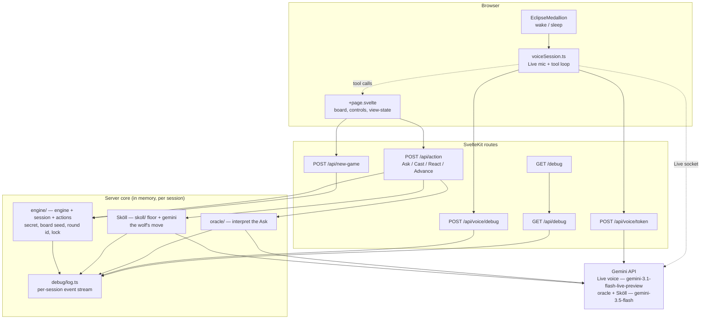
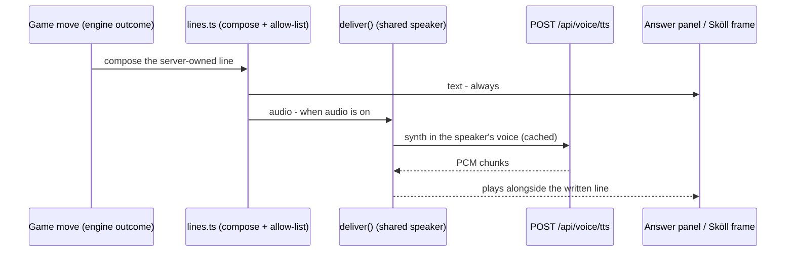
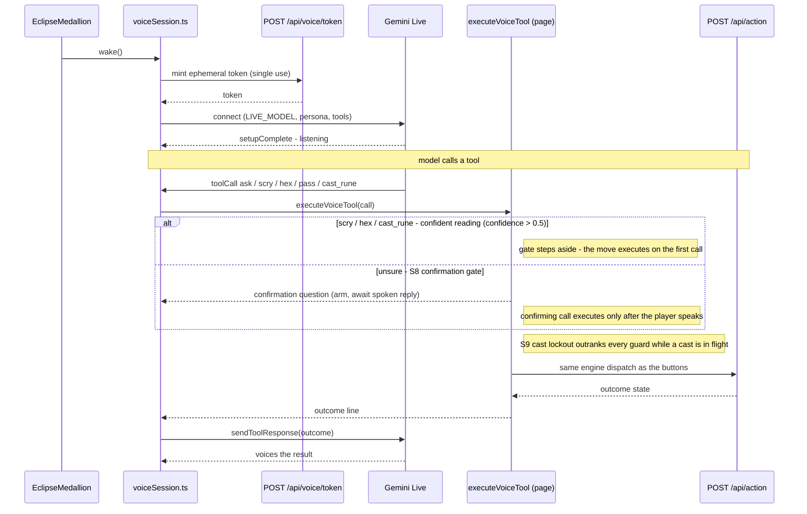
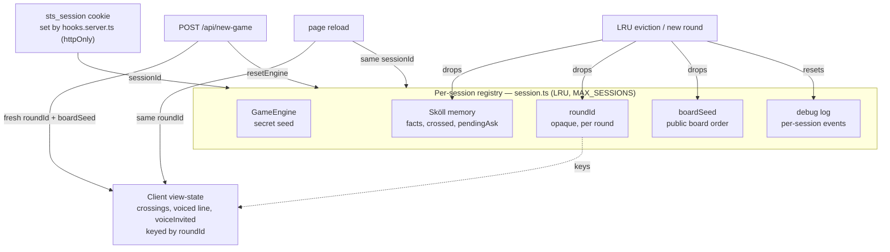

# 🏗️ Architecture

How Save the Sun is wired: a Svelte 5 browser, SvelteKit routes, a deterministic in-memory server core, and the Gemini API. The engine owns the secret and referees every turn; Gemini only ever interprets language, plays Sköll, and voices the Oracle.

- Design intent: [`prd.md`](prd.md)
- Mechanics: [`game-spec.md`](game-spec.md)
- Voice contract: [`v2-voice-requirements.md`](v2-voice-requirements.md)

---

## System overview

The browser drives three surfaces (the board page, the voice session, the medallion). All game truth lives server-side, per session, in memory. Gemini sits behind the routes — never the browser, except the Live socket (opened with a single-use ephemeral token).

- **Engine** holds the secret and judges casts. Gemini never sees the secret.
- **Sköll** runs his own deduction; the deterministic floor catches a failed or illegal Gemini call.
- **Log** is the public `/debug` stream — the on-stage proof the engine owns truth. The Gemini API key never enters it.

---

## Turn / Advance flow

A human Ask is one POST. Sköll's own move is a **separate** `Advance` POST the client fires afterward, so the human's answer paints first and the wolf moves under a live pill. Everything touching shared state runs under `withSessionLock`, serializing per-session mutation so a duplicate tab or retry can't interleave.

- A refusal (negation, mixed-type, secret-seeking) never opens a window, spends the turn, or rouses Sköll.
- `Advance` carries no payload and is a no-op if it isn't Sköll's turn — a stray one is harmless.
- A failed `Advance` leaves the turn with Sköll and surfaces a retry; it never clobbers the human's earned answer.

---

## Voice — input (the Live mic) and output (delivery)

Voice is two decoupled layers. **Output** is mic-independent: every game move is composed server-side and voiced through one TTS route and a shared speaker, so the board speaks whether or not the mic is on. **Input** is the optional Live mic, reached through the medallion. The board buttons and the text box play fully without either.

### Output — delivery

Every game move (R10) is composed server-side, allow-listed (`src/lib/server/voice/lines.ts`), and voiced through one `deliver()` seam (`src/lib/voice/delivery.ts`): written to its panel or frame **always**, and played through the shared TTS speaker **when audio is on**. One `POST /api/voice/tts` route serves both characters via a `voice` param, each line wrapped in its speaker\'s director\'s-notes (`synthPrompt`) so the model voices it in character — Sköll a deep gravelly growl, the Oracle a brisk reverent weight.

- **Server-owned, allow-listed.** The route voices only known line IDs (engine outcomes, the pre-engine refusals and guards), never arbitrary client text, so it can\'t be spammed for free TTS. The finite templated lines are cached.
- **Both voices, one route.** The Oracle\'s answers, refusals, reaction resolutions, and cast outcomes are hers; **Sköll\'s Ask and the loss outcome are his**. A win speaks in the Oracle\'s voice (the victory coda), a loss in Sköll\'s (the night-everlasting verse), so the player hears who took the day.
- **Mic-independent.** Output rides this seam regardless of the mic; the output-mute control (below) silences it without touching the captions.
- **Deferred** (`ttd.md`): Sköll\'s winning cast voiced (the dynamic `{Rune}`, once it rides the `Advance` wire) and the audio-only ambience taunt layer (`ux-copy.md` section 2).

### Input — the Live mic (optional)

A medallion wake mints a single-use token, connects the Gemini Live session, and hands the model declared tools. When the model calls one, the page executor runs it through the **same engine dispatch as the buttons**, then voices the result line back. The board and text box never depend on this being alive.

- The browser only ever holds the **ephemeral** token; the real `GEMINI_API_KEY` stays server-side, masked at the debug sink.
- **S8 gate** - `scry`, `hex`, `cast_rune` are destructive (a one-night charge or the whole round). The model scores each call with a `confidence` (0-1) for how surely it read her words; above `0.5` the executor skips the gate and the move lands on the first call (no confirmation echo). At or below it - or with no confidence at all - the first call only arms a confirmation and asks again. Client-authoritative: while the gate holds, nothing reaches the engine until the player has spoken since arming.
- **S9 lockout** - while a cast is in flight (`casting`), the executor seals: the lockout outranks every guard and the gate.
- A denied or absent mic seals the session into the terminal `eclipsed` state and is never re-prompted; the button game is never affected.

### Controls

- **Eclipse medallion** - the click on/off voice control (tap to wake the mic, tap to sleep) and the living indicator. All animation is the Oracle alive: the corona breathes while listening, flares with the player\'s voice while hearing, and pulses while she speaks. **When Sköll speaks the disc deepens toward total eclipse with an ember rim** - the sun devoured - so the speaker reads by brightness and shape, never color alone. Reduced motion swaps the pulses for static glow intensities. Each state carries an ARIA label and a polite live-region announcement.
- **Output mute** - a separate toggle that silences both voices while their captions keep arriving in the panel. Set-and-forget, persists for the session (R11), independent of the mic: muting is not sleeping.

## Session & state lifecycle

`hooks.server.ts` sets one `sts_session` cookie per browser (httpOnly). That `sessionId` keys an LRU-capped registry in `session.ts` holding the engine, Sköll's memory, the round id, the board seed, and the debug log — all lifecycle-linked. A reload resumes; a new game resets.

- **`roundId`** is opaque and independent of the secret seed, so exposing it can't leak the answer. It's stable across a refresh (same round) and reminted on a new round, so persisted crossings never restore onto a fresh secret.
- **`boardSeed`** fixes the on-screen board order for the round's life — a reload doesn't reshuffle. Independent of the secret seed.
- The registry is LRU-capped at `MAX_SESSIONS`; evicting a session drops its Sköll memory, round id, board seed, and log together.
- All state is in-memory: no accounts, no database.
