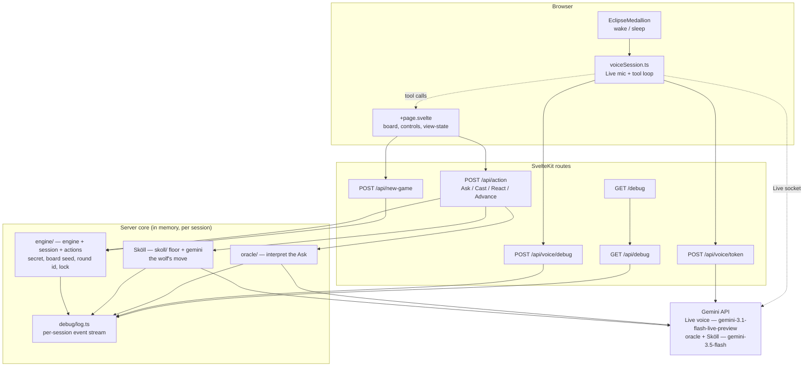
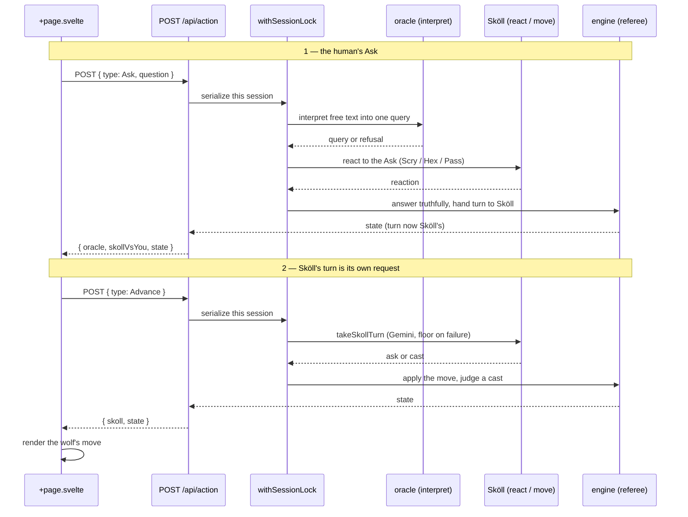
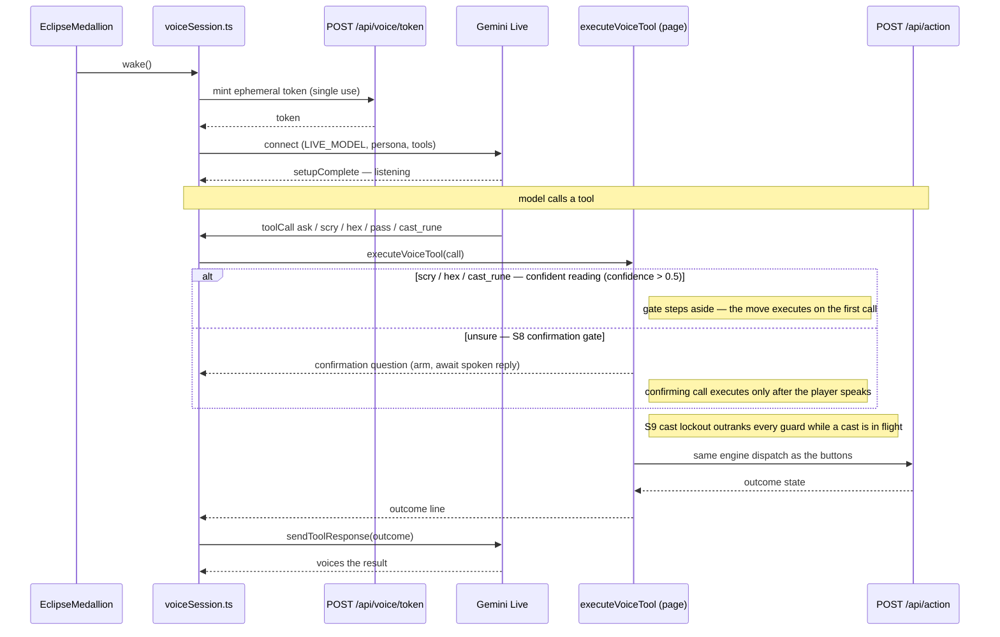
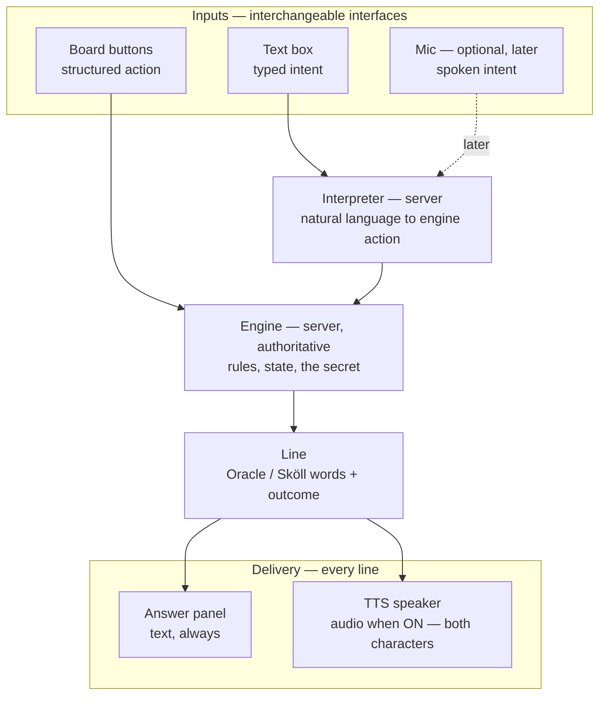
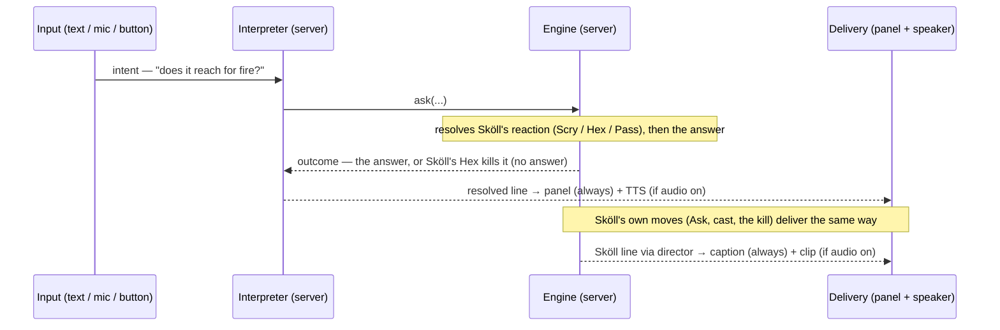
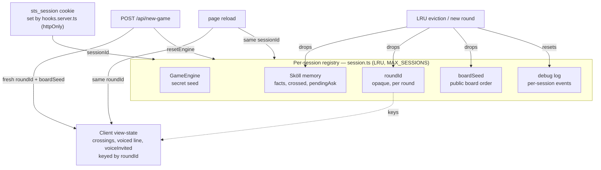

# 🏗️ Architecture

How Save the Sun is wired: a Svelte 5 browser, SvelteKit routes, a deterministic in-memory server core, and the Gemini API. The engine owns the secret and referees every turn; Gemini only ever interprets language, plays Sköll, and voices the Oracle.

- Design intent: [`prd.md`](prd.md)
- Mechanics: [`game-spec.md`](game-spec.md)
- Voice contract: [`v2-voice-requirements.md`](v2-voice-requirements.md)

---

## System overview

The browser drives three surfaces (the board page, the voice session, the medallion). All game truth lives server-side, per session, in memory. Gemini sits behind the routes — never the browser, except the Live socket (opened with a single-use ephemeral token).

- **Engine** holds the secret and judges casts. Gemini never sees the secret.
- **Sköll** runs his own deduction; the deterministic floor catches a failed or illegal Gemini call.
- **Log** is the public `/debug` stream — the on-stage proof the engine owns truth. The Gemini API key never enters it.

---

## Turn / Advance flow

A human Ask is one POST. Sköll's own move is a **separate** `Advance` POST the client fires afterward, so the human's answer paints first and the wolf moves under a live pill. Everything touching shared state runs under `withSessionLock`, serializing per-session mutation so a duplicate tab or retry can't interleave.

- A refusal (negation, mixed-type, secret-seeking) never opens a window, spends the turn, or rouses Sköll.
- `Advance` carries no payload and is a no-op if it isn't Sköll's turn — a stray one is harmless.
- A failed `Advance` leaves the turn with Sköll and surfaces a retry; it never clobbers the human's earned answer.

---

## Voice Live-session + tool-call loop

> **Current implementation — being migrated.** This is the shipped Live-monolith design (S1–S10). It is the subject of the [voice rearchitecture](#target-architecture--voice-as-delivery-planned) below: the Live session here owns input, interpretation, output, and state all at once, which is the defect the target design unwinds. Kept for reference until the migration lands.

A medallion wake mints a single-use token, connects the Gemini Live session, and hands the model declared tools. When the model calls one, the page executor runs it through the **same engine dispatch as the buttons**, then voices the result line back through the socket.

- The browser only ever holds the **ephemeral** token; the real `GEMINI_API_KEY` stays server-side, masked at the debug sink.
- **S8 gate** — `scry`, `hex`, `cast_rune` are destructive (a one-night charge or the whole round). The model scores each call with a `confidence` (0–1) for how surely it read her words; above `0.5` the executor skips the gate and the move lands on the first call (no confirmation echo). At or below it — or with no confidence at all — the first call only arms a confirmation and asks again. Client-authoritative: while the gate holds, nothing reaches the engine until the player has spoken since arming.
- **S9 lockout** — while a cast is in flight (`casting`), the executor seals: the lockout outranks every guard and the gate.
- The button game never depends on the voice module being alive; a denied or absent mic seals the session into the terminal `eclipsed` state and is never re-prompted.

---

## Target architecture — voice as delivery (planned)

The goal is one sentence: **have a conversation with the Oracle in order to play the game.** A conversation is turn-taking I/O over the engine — express intent, hear and read the reply, act, hear the reaction. It does **not** require a real-time mic, barge-in, or a persistent socket. Those are *one possible input modality*, not the goal.

**Root defect of the current design:** voice is a *session you are trapped inside* (Live), and that session is welded to the mic. So audio only exists while the mic is live (the mic became the "is it on" indicator), Sköll has nowhere to speak (he is not in her session), the text box and mic forked into two paths into Live (the `direct()` / `beginInvitation()` duplication), and a token + socket + silence clock + barge-in race are carried just to say one sentence.

**The fix:** stop treating voice as a session; treat it as **delivery**. Three layers, each agnostic to the others — exactly the existing principle that "the button game never depends on voice," lifted one level so the *conversation* never depends on the *mic*.

- **Inputs are interchangeable.** Buttons dispatch a structured action straight to the engine. The text box (and a later, optional mic) send natural-language intent to one server-side interpreter. No input owns the experience.
- **Interpretation is centralized, server-side, single.** Today the text box interprets on the server while Live interprets via tool calls — two brains kept in parity by hand (the whole S7 "voice and button produce identical engine state" assertion exists *because* of this). One interpreter erases the parity problem by construction.
- **Audio is delivery, not a session.** Every line — the Oracle's answer, a guard, Sköll's taunt — is composed once and delivered as text (always) and as audio when audio is on. The shared speaker queue is **source-agnostic**: the Oracle's audio is synthesized by the server TTS route (cached); Sköll's is his **prebuilt clip** (Algieba, R8), played as-is and never re-synthesized through her TTS path. Mic-independent. The Oracle's text lands in the Answer panel; Sköll's caption rides his own frame, never the Oracle's panel — so "everything spoken is also written" (R10) holds for both. His clips and director are net-new work (P2), not a pipeline that exists today.
- **One audio toggle gates both voices.** It is the indicator the mic was wrongly serving as — a first-class on/off, mic-independent, persisted for the session. Audio on ⇒ both the Oracle and Sköll are voiced; audio off ⇒ both are silent and the board plays on with text only. The mic is a *separate*, optional input (P5), never the gate for whether anything is heard. This is the symmetry the old design broke: Sköll could only speak while her mic was live, which would have forced the Oracle to narrate every silent board move too.

The Ask reaction is **not** a post-answer event: the engine resolves Sköll's Scry/Hex/Pass *before* the answer (a Hex spends the turn with no answer at all), so the composed line already carries the kill — the delivery layer never speaks an answer ahead of it. Sköll's *own* moves (his Ask, his cast, the kill) are the separate engine-event path.

### What Live becomes (and why this is the right substrate for it)

Live is **demoted, not deleted.** Its only unique value is real-time mic barge-in. On the layered substrate it returns later as a thin, opt-in adapter doing exactly two things — mic → STT → push text into the existing interpreter, and a barge-in signal that stops the shared speaker. It does **not** own her audio: output still flows through the same delivery seam as everything else, so the audio toggle and one-speaker-at-a-time coordination keep working and the split-output coupling never returns. Rather than the foundation everything tangles into, the expensive, correctness-critical work (interpretation, engine parity, the destructive-confirmation and cast-lockout rules, line composition, delivery, the medallion state machine) is built **once, server-side, tested without a browser or socket**, and Live inherits all of it. A future Live integration lands on a clean front door rather than rebuilding the house.

### Salvaged vs. shelved

| Kept (load-bearing, reused) | Shelved / rebuilt later |
|---|---|
| Engine, buttons, board, `/debug`, session lifecycle | Live client socket/token/setup-timeout (S1, S2) |
| Server-side Oracle interpret path (becomes the one interpreter) | Mic permission seal + silence timeout (S4, S5) — only meaningful with a mic |
| `createSpeaker` — plays TTS PCM identically to Live PCM | Live-side tool-call plumbing (S7–S9 *wiring*; the engine actions stay) |
| Medallion — repurposed as audio-state display + the audio toggle | Streamed-transcription captions (S10) — the panel renders the engine line instead |
| The Sköll-clip *approach* (prebaked TTS played locally) — the model for *all* audio | Hands-free voice + barge-in — returns as the opt-in Live adapter |

> **S12 is not a kept asset — it is new work.** Only Sköll's script is drafted (`v2-implementation-checklist.md` S12, `v2-voice-requirements.md` R8); the clip library, the build script, and the director that triggers clips do not exist yet. P2 below builds them. The *approach* is reused; the audio source is net-new, and P4 must not retire Live until P2 has actually given board-only play a Sköll voice.

Shelved code is reference-able in git history, not lost — and it was the fragile part. Whole **classes** of bug go with it: caption overwrite/truncation (no racing fragments — the panel renders the composed line), voice/button parity drift (one interpreter), silence-timeout tuning (no mic), and the `direct()`/`beginInvitation()` fork (one `deliver()` path).

---

## Migration plan — Live monolith → layered delivery

Phased so each step ships independently and the button game never regresses. Order matters: stand up the new delivery path **before** removing the old Live one.

- [ ] **P1 — One spoken-line path.** Two pieces, in order. **(a) The shared speaker queue** — `createSpeaker` already plays base64 PCM in the browser; wrap it as the one `deliver(line)` seam that any audio source feeds (TTS now, prebuilt clips in P2). The queue never synthesizes; it only plays audio + renders the caption. **(b) The server-side TTS route** — the Oracle's audio *source* behind `deliver()`: turns a *server-composed line* into audio, key staying server-side. Net-new (the sole voice route today mints Live tokens; after P4 there is otherwise no key-safe way to voice her text). Abuse guards are not optional — per-session **and** global rate limits, and it voices only **server-owned, allow-listed lines** (engine outcomes, the pre-engine refusals/guards, and the greeting — see Constraints), never arbitrary client text, so it can't be spammed for free Gemini TTS once the token path is gone. Cache the finite, templated Oracle lines so most turns replay a cached clip. Then her answer flows text-box → interpret → engine → line → `deliver()`, and the S6 greeting is the round's first delivered line (no wake event). **Audio is gated behind a user gesture** (Constraints): the audio toggle's enabling tap lands here, not P3, and audio stays off until it inits the speaker. No mic. Collapses `direct()` + `beginInvitation()` once the route exists.
- [ ] **P2 — Build + wire Sköll's voice.** Net-new (S12 is a drafted script only): generate the clip library as **static assets** (Algieba, prebuilt — zero runtime TTS, per R8), and build the **director** that picks a clip on engine events (his first turn, wrong cast, hex, the kill, win/lose) and hands it to the shared `deliver()` queue **as audio** — bypassing the Oracle TTS route entirely (his lines are never synthesized at runtime) — rendering his caption on his frame. Audible during board-only play, mic off. Triggers are **engine events only** — the taunt bucket defers to P5, and R9 one-speaker/mic-isolation applies while Live still coexists (Constraints). The spoken clips are his **fixed** buckets; his Ask and cast-naming stay text on his frame (Constraints — dynamic content, already written). Hard prerequisite for P4: until it lands, retiring Live leaves board-only play with no Sköll voice.
- [ ] **P3 — Audio toggle + medallion repurpose.** Rework the already-shipped S11 output-mute control (#56) into the audio on/off indicator on the new delivery layer — persisted for the session, no longer redundant with sleep; medallion shows audio/speaking state, not a mic gate. Reduced-motion + a11y carried over.
- [ ] **P4 — Retire the Live monolith.** Remove the Live client lifecycle, the token endpoint, mic-permission seal, and silence timeout (S1/S2/S4/S5), plus the Live-side tool-call wiring (S7–S9) — keeping every engine action the buttons use. Update this doc's "current" section to match.
- [ ] **P5 — (Later, opt-in) Live as a mic adapter.** Reintroduce Live scoped to **mic → STT → interpreter** plus a **barge-in signal** — never her audio. Output stays on the shared delivery seam from P1, so the audio toggle and one-speaker coordination still hold; barge-in means "stop the shared speaker," not "Live plays her." A bounded adapter on the finished substrate, not the substrate. **Prerequisites (four, not one):** (1) **Widen the interpreter** — today's `Interpret = question → Query | Refusal` (`oracle/types.ts`) only resolves an Ask; the spoken path needs the full engine-action union (Hex/Scry/Pass/Cast), which the Live tool-calls handled before P4 removed them. (2) **Scope it per input** — that union is the *spoken* allow-set only; typed input stays Ask-only, or "cast Sowilo" typed in the box becomes a Cast the board buttons already own. The diagram routes text and mic through the same interpreter, so the allow-set must be a per-input parameter, not a global widening. (3) **Re-home the spoken safety gates** — R4/R5's destructive confirmation and cast lockout lived in the S7–S9 Live wiring that P4 removed, so a spoken "cast Sowilo" would otherwise go STT → interpreter → engine ungated; they must be re-established at the interpreter/engine boundary so every spoken destructive move is gated regardless of adapter. (4) **Restore the mic lifecycle** (Constraints) — the R1 permission/denied seal, the R7 silence timeout, and an R2 ephemeral-token/auth boundary for the Live STT link. All net-new work the spoken path forces; typed and button play never needed them.

**Dependencies & order.** P1 is the foundation (the `deliver()` seam + the TTS route). P3 needs P1. **P4 needs both P1 and P2** — retiring Live before the Oracle has a non-Live voice *and* board-only play has Sköll's voice is a regression. P5 needs P4 plus the three P5 prerequisites above. R4/R5 (spoken destructive confirmation, cast lockout) have no work in P1–P4: with no mic there are no spoken actions to gate, and the board keeps its own cast confirmation — they return with the mic in P5.

### Constraints carried through every phase

Cross-cutting invariants the phases must honor — listed once here so each phase references them instead of re-deriving them:

- **Audio needs a user gesture.** Browsers block `AudioContext` without one, and the retired R1 medallion tap used to supply it. So the audio toggle's *enabling gesture* lands in **P1**, not P3 (P3 only repurposes the medallion's visuals/labels): audio stays off until a tap inits/resumes the speaker, and the first line never auto-plays from an async TTS response.
- **The TTS route voices an allow-list, not "engine outcomes only."** Server-owned, allow-listed lines — engine outcomes, the pre-engine refusals/guards (`prepareAsk` returns these without consuming a turn), and the folded-in greeting — are all voiced; only *arbitrary client text* is refused. Validate line IDs, not "did the engine run."
- **One speaker / mic isolation (R9) the instant two sources coexist.** P2 ships before P4, so the clip director coexists with a still-live Live mic session: a Sköll clip must pause mic streaming and never overlap the Oracle (R9), or be suppressed while Live is awake. Not a P5-only concern.
- **Taunt-triggered Sköll clips need a spoken input.** R8/S13's taunt bucket fires on the player addressing him, detected from input transcripts. With no mic (P1–P4) and the typed box Ask-only, there is nothing to detect — so **P2 wires only the engine-event triggers, and the taunt bucket defers to P5** (the mic). Not dropped; deferred.
- **P5 restores the full mic lifecycle, not just STT + barge-in.** The permission/denied terminal seal (R1, no re-prompt), the 5 s silence timeout (R7), and an **ephemeral-token/auth boundary** so the Live STT link never exposes the long-lived key — R2's guarantee, retired for *output* in P4, returns here scoped to the mic.
- **Sköll's dynamic lines stay text; only his fixed taunt buckets are spoken.** His Ask names a sign and his winning cast names a `{Rune}` (`ux-copy.md` §2) — dynamic content no single prebuilt clip can carry. Those lines remain text on his frame (already written, so R10 holds, and the player still sees the Ask they must Scry/Hex/Pass); the prebuilt library is the **fixed** taunt buckets only. Voicing the dynamic lines later means per-rune/per-sign prebuilds or a narrow TTS exception — a future call, not a P2 blocker.

### What every requirement and story maps to

One row per spec item so nothing is silently dropped — the shipped record (`v2-voice-requirements.md`, `v2-implementation-checklist.md`) is honest about what holds, defers, or is replaced.

| Spec item | Fate |
|---|---|
| R3 engine parity · R10 everything-written · R11 output mute | **Holds** — delivery-agnostic; one toggle, panel + captions carry it |
| R1 Live session · R2 token endpoint | **Superseded for output** — server TTS endpoint (P1). R2's ephemeral-token/auth boundary and R1's mic lifecycle **return in P5** for the opt-in Live STT link (Constraints) |
| R4 spoken confirm · R5 cast lockout · R7 silence timeout · Goal 2 barge-in | **Deferred to P5** — mic-path only; no spoken actions exist before the mic returns |
| R6 medallion control + indicator · S3 | **Repurposed (P3)** — audio-state display + the toggle; the mic-privacy indicator returns with P5 |
| R8 Sköll clips · R9 mic discipline · S12 · S13 | **New work (P2)** — clips + director built then; R9 one-speaker/mic-isolation applies whenever Live coexists, and the **taunt bucket defers to P5** (needs a spoken input) |
| S1 · S2 · S4 · S5 | **Shelved (P4)** — Live lifecycle, token endpoint, mic seal, silence clock |
| S6 wake greeting | **Folds into delivery (P1)** — the round's first spoken line, no wake event |
| S7 · S8 · S9 | **Engine actions kept; Live tool-call wiring shelved (P4)**; spoken confirm/lockout return in P5 |
| S10 transcripts | **Replaced (P1/P2)** — the panel renders the composed engine line, no streamed fragments |
| S11 output mute | **Reworked (P3)** — its gain-mute + session preference become the audio toggle |

The spec and checklist both open with a banner pointing here and mark their Live-coupled locked decisions superseded; story-level rewrites land per phase rather than up front, so the shipped record stays honest until the code actually moves.

---

## Session & state lifecycle

`hooks.server.ts` sets one `sts_session` cookie per browser (httpOnly). That `sessionId` keys an LRU-capped registry in `session.ts` holding the engine, Sköll's memory, the round id, the board seed, and the debug log — all lifecycle-linked. A reload resumes; a new game resets.

- **`roundId`** is opaque and independent of the secret seed, so exposing it can't leak the answer. It's stable across a refresh (same round) and reminted on a new round, so persisted crossings never restore onto a fresh secret.
- **`boardSeed`** fixes the on-screen board order for the round's life — a reload doesn't reshuffle. Independent of the secret seed.
- The registry is LRU-capped at `MAX_SESSIONS`; evicting a session drops its Sköll memory, round id, board seed, and log together.
- All state is in-memory: no accounts, no database.
