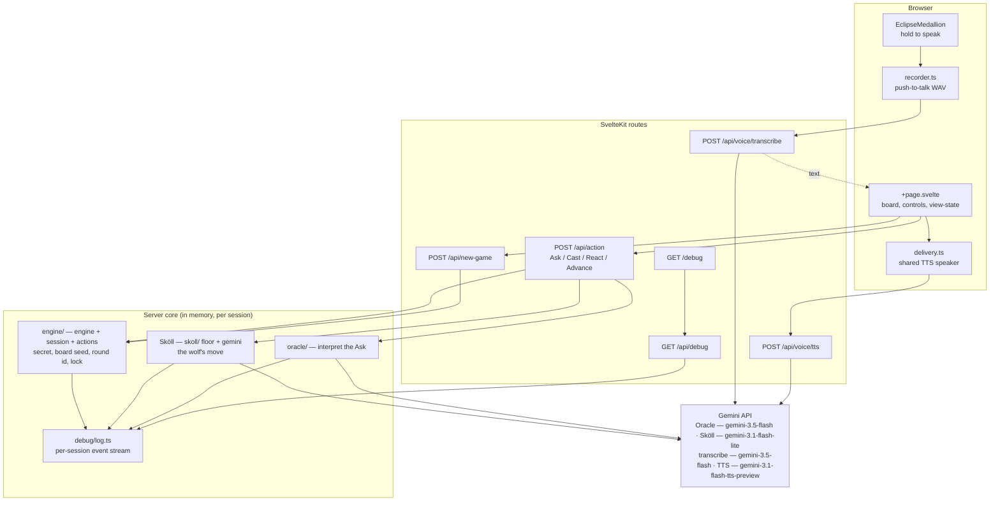
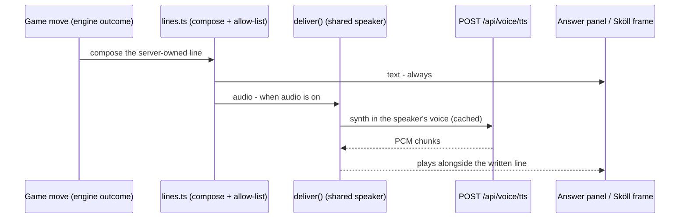
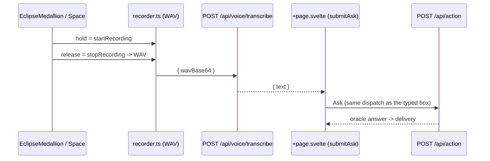
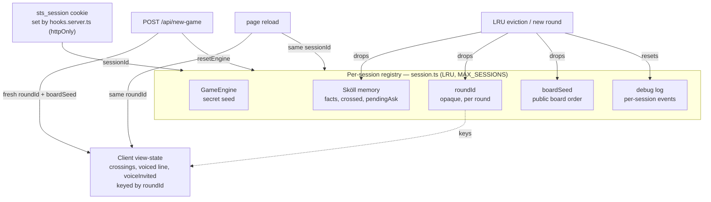

# 🏗️ Architecture

How Save the Sun is wired: a Svelte 5 browser, SvelteKit routes, a deterministic in-memory server core, and the Gemini API. The engine owns the secret and referees every turn; Gemini only ever interprets language, plays Sköll, and voices the Oracle.

- Design intent: [`prd.md`](prd.md)
- Mechanics: [`game-spec.md`](game-spec.md)
- Voice contract: [`v2-voice-requirements.md`](v2-voice-requirements.md)

---

## System overview

The browser drives three surfaces (the board page, the push-to-talk recorder, the medallion). All game truth lives server-side, per session, in memory. Gemini sits behind the routes — the browser never holds the key.

- **Engine** holds the secret and judges casts. Gemini never sees the secret.
- **Sköll** runs his own deduction; the deterministic floor catches a failed or illegal Gemini call.
- **Log** is the public `/debug` stream — the on-stage proof the engine owns truth. The Gemini API key never enters it.

---

## Turn / Advance flow

A human Ask is one POST. Sköll's own move is a **separate** `Advance` POST the client fires afterward, so the human's answer paints first and the wolf moves under a live pill. Everything touching shared state runs under `withSessionLock`, serializing per-session mutation so a duplicate tab or retry can't interleave.

- A refusal (negation, mixed-type, secret-seeking) never opens a window, spends the turn, or rouses Sköll.
- `Advance` carries no payload and is a no-op if it isn't Sköll's turn — a stray one is harmless.
- A failed `Advance` leaves the turn with Sköll and surfaces a retry; it never clobbers the human's earned answer.

---

## Voice — input (push-to-talk) and output (delivery)

Voice is two decoupled layers. **Output** is mic-independent: every game move is composed server-side and voiced through one TTS route and a shared speaker, so the board speaks whether or not the mic is on. **Input** is push-to-talk: hold the medallion (or hold `Space`) to record an Ask, release to send. There is no real-time session — one held recording per Ask, turn-based like the text box. The board buttons and the text box play fully without the mic.

### Output — delivery

Every game move (R10) is composed server-side, allow-listed (`src/lib/server/voice/lines.ts`), and voiced through one `deliver()` seam (`src/lib/voice/delivery.ts`): written to its panel or frame **always**, and played through the shared TTS speaker **when audio is on**. One `POST /api/voice/tts` route serves both characters via a `voice` param, each line wrapped in its speaker's director's-notes (`synthPrompt`) so the model voices it in character — Sköll a deep gravelly growl, the Oracle a brisk reverent weight.

- **Server-owned, two paths, no client text.** The route voices either a known line ID recomposed from the engine's truth (`lines.ts` allow-list — engine outcomes, refusals, guards; cached), **or** a Gemini-authored line stashed server-side and fetched by an opaque per-session id (`storeVoiceLine`/`getVoiceLine`). Either way the words come from the server, never the wire, so it can't be spammed for free TTS.
- **Live authoring, guarded.** The Oracle's clean answer is dramatized by Gemini per Ask (`composeOracleFlair`), and the end screen speaks a fresh in-character line — the Oracle's blessing on a win, Sköll's gloat on a loss (`composeEndingFlair`). Authoring is bounded + timed-out with a deterministic fallback, and an answer flair that doesn't open with the engine's own Yes/No is discarded — the Oracle never lies, even in flair.
- **Both voices, one route.** The Oracle's answers, refusals, reaction resolutions, cast outcomes, and the win blessing are hers; **Sköll's Ask, his winning cast, and the loss gloat are his** — so the player hears who took the day.
- **Mic-independent + recoverable.** Output rides this seam regardless of the mic; the output-mute control (below) silences it without touching the captions. The last voiced line is recorded per session, so a dropped action's response can recover and re-voice the real result instead of a false silent line.
- **Deferred** (`ttd.md`): the audio-only ambience taunt layer (`ux-copy.md` section 2).

### Input — push-to-talk (optional)

Holding the medallion (or `Space`) records a short utterance; releasing sends it to `POST /api/voice/transcribe`, which transcribes it server-side via Gemini and returns the text. The page then runs that text through the **exact same Ask pipeline as the text box** — interpret → engine → delivery — so a spoken Ask and a typed Ask are identical past transcription. The mic opens once (one permission prompt); the board and text box never depend on it.

- **Server-side key, allow-listed surface.** The browser sends only audio; `GEMINI_API_KEY` stays server-side (masked at the debug sink). The transcribe route is rate-limited per session and globally, like the TTS route.
- **Ask, plus the reaction.** A held reply produces an Ask — or, when Sköll's question hangs, a scry/hex/pass classified server-side (`reaction` mode of the transcribe route), run through the same `performReact` dispatch the buttons use. A mishear is safe: an `unclear` reply asks again and a spent scry/hex is refused, never a silent pass. Cast stays on the board button (with its own confirmation).
- **Turn-based.** A held recording is one request/response — no socket, no silence timeout, no barge-in. `Space` is the talk key everywhere except inside a text field (where it types); buttons keep Enter for keyboard activation.
- A denied or absent mic seals the medallion into the inert `denied` state (one quiet notice, never re-prompted); the button + text game is untouched.

### Controls

- **Eclipse medallion** — the push-to-talk control (hold to record, release to ask — pointer or `Space`) and the living indicator: idle when ready, a flaring corona while recording, the rune ring orbiting while the utterance is transcribed, and the corona pulsing while a line plays. **When Sköll speaks the disc deepens toward total eclipse with an ember rim** — the sun devoured — so the speaker reads by brightness and shape, never color alone. Reduced motion swaps the pulses for static glow intensities. Each state carries an ARIA label and a polite live-region announcement.
- **Output mute** — a separate toggle that silences both voices while their captions keep arriving in the panel. Set-and-forget, persists for the session (R11), independent of the mic: muting is not sleeping.

## Session & state lifecycle

`hooks.server.ts` sets one `sts_session` cookie per browser (httpOnly). That `sessionId` keys an LRU-capped registry in `session.ts` holding the engine, Sköll's memory, the round id, the board seed, and the debug log — all lifecycle-linked. A reload resumes; a new game resets.

- **`roundId`** is opaque and independent of the secret seed, so exposing it can't leak the answer. It's stable across a refresh (same round) and reminted on a new round, so persisted crossings never restore onto a fresh secret.
- **`boardSeed`** fixes the on-screen board order for the round's life — a reload doesn't reshuffle. Independent of the secret seed.
- The registry is LRU-capped at `MAX_SESSIONS`; evicting a session drops its Sköll memory, round id, board seed, and log together.
- All state is in-memory: no accounts, no database.
