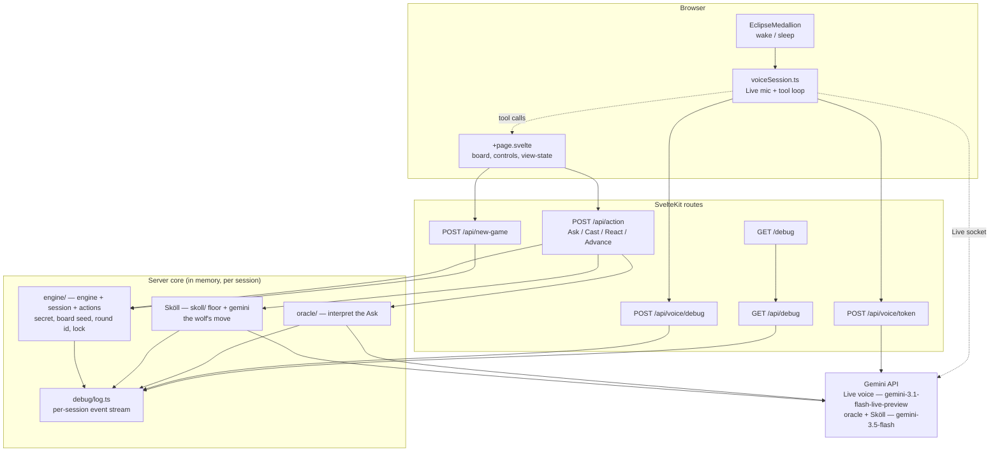
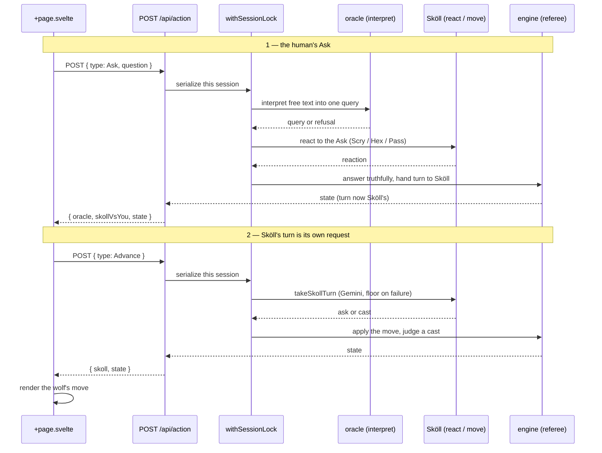
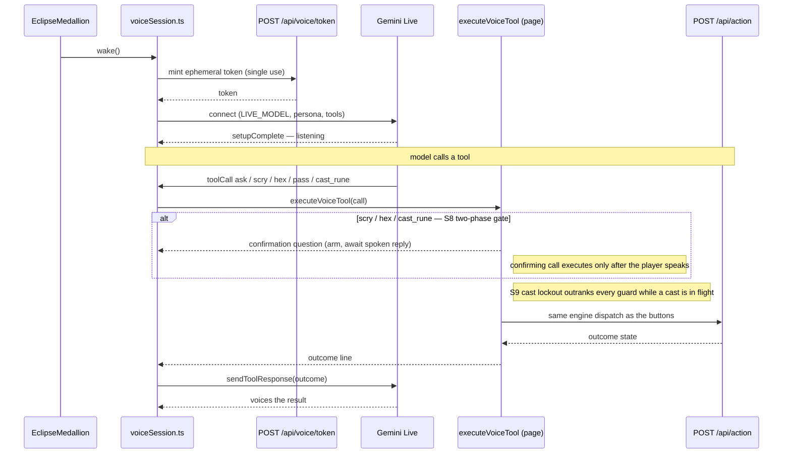
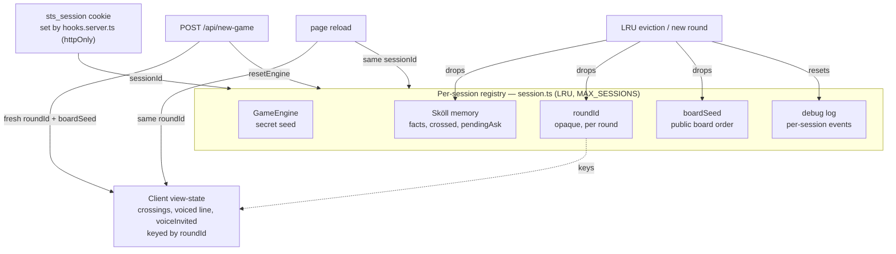

# 🏗️ Architecture

How Save the Sun is wired: a Svelte 5 browser, SvelteKit routes, a deterministic in-memory server core, and the Gemini API. The engine owns the secret and referees every turn; Gemini only ever interprets language, plays Sköll, and voices the Oracle.

- Design intent: [`prd.md`](prd.md)
- Mechanics: [`game-spec.md`](game-spec.md)
- Voice contract: [`v2-voice-requirements.md`](v2-voice-requirements.md)

---

## System overview

The browser drives three surfaces (the board page, the voice session, the medallion). All game truth lives server-side, per session, in memory. Gemini sits behind the routes — never the browser, except the Live socket (opened with a single-use ephemeral token).

- **Engine** holds the secret and judges casts. Gemini never sees the secret.
- **Sköll** runs his own deduction; the deterministic floor catches a failed or illegal Gemini call.
- **Log** is the public `/debug` stream — the on-stage proof the engine owns truth. The Gemini API key never enters it.

---

## Turn / Advance flow

A human Ask is one POST. Sköll's own move is a **separate** `Advance` POST the client fires afterward, so the human's answer paints first and the wolf moves under a live pill. Everything touching shared state runs under `withSessionLock`, serializing per-session mutation so a duplicate tab or retry can't interleave.

- A refusal (negation, mixed-type, secret-seeking) never opens a window, spends the turn, or rouses Sköll.
- `Advance` carries no payload and is a no-op if it isn't Sköll's turn — a stray one is harmless.
- A failed `Advance` leaves the turn with Sköll and surfaces a retry; it never clobbers the human's earned answer.

---

## Voice Live-session + tool-call loop

A medallion wake mints a single-use token, connects the Gemini Live session, and hands the model declared tools. When the model calls one, the page executor runs it through the **same engine dispatch as the buttons**, then voices the result line back through the socket.

- The browser only ever holds the **ephemeral** token; the real `GEMINI_API_KEY` stays server-side, masked at the debug sink.
- **S8 gate** — `scry`, `hex`, `cast_rune` are destructive (a one-night charge or the whole round), so the first call only arms a confirmation and asks again. Client-authoritative: nothing reaches the engine until the player has spoken since arming.
- **S9 lockout** — while a cast is in flight (`casting`), the executor seals: the lockout outranks every guard and the gate.
- The button game never depends on the voice module being alive; a denied or absent mic seals the session into the terminal `eclipsed` state and is never re-prompted.

---

## Session & state lifecycle

`hooks.server.ts` sets one `sts_session` cookie per browser (httpOnly). That `sessionId` keys an LRU-capped registry in `session.ts` holding the engine, Sköll's memory, the round id, the board seed, and the debug log — all lifecycle-linked. A reload resumes; a new game resets.

- **`roundId`** is opaque and independent of the secret seed, so exposing it can't leak the answer. It's stable across a refresh (same round) and reminted on a new round, so persisted crossings never restore onto a fresh secret.
- **`boardSeed`** fixes the on-screen board order for the round's life — a reload doesn't reshuffle. Independent of the secret seed.
- The registry is LRU-capped at `MAX_SESSIONS`; evicting a session drops its Sköll memory, round id, board seed, and log together.
- All state is in-memory: no accounts, no database.
