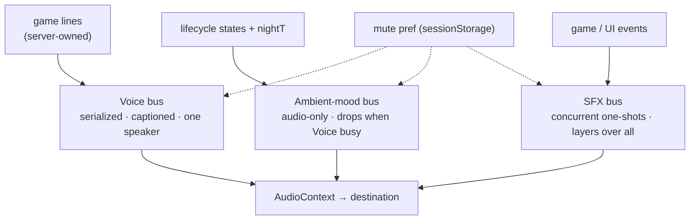

# V3 — Ambient Mood & Sound Effects 🔊

> Save the Sun — the wolf mutters from the dark, and the rite makes its own sounds.
> Status: Draft v1 · 2026-06-17
>
> Builds on [`v2-voice-requirements.md`](./v2-voice-requirements.md) (the Oracle + Sköll **game-move** voice) and the delivery seam in [`architecture.md`](./architecture.md#voice--input-push-to-talk-and-output-delivery).

---

## Scope 🎯

Two new **audio-only** layers on top of the v2 voice. Neither carries game state, so neither captions (R10 exemption):

1. **Ambient mood** — Sköll's atmosphere between turns (the taunt buckets in [`ux-copy.md`](./ux-copy.md) §2: splash open, idle, hunt mood, defeat exit). His *voice*, not game moves.
2. **Sound effects** — short non-vocal one-shots for game and UI events (cast, cross-off, hex, win/loss sting, medallion wake).

## Non-goals 🚫

- Captions for either layer — they carry no game state by rule (R10).
- A trigger rules engine (cooldowns, priority arbitration, per-clip eligibility). Buckets bind to states; that is the whole model.
- Sól gaining a voice. Two voices remain: Oracle, Sköll.

## Sequencing ⏭️

**This is the last voice layer.** It lands *after* the live wiring still owed by v2:

- WAV transcribe payload verified end-to-end against the live Gemini API (`ttd.md`).
- Any remaining live-path verification of the push-to-talk + TTS delivery loop.

Ambient/SFX is pure enhancement — it must not block a working voice demo, and a failure in either layer degrades to silence with zero game impact.

---

## The three audio buses 🎛️

Everything audible is one of three buses. They differ only in **concurrency** and **trigger source** — all three share one mute preference and one output.

| Bus | Concurrency | Captioned | Source | Trigger |
|---|---|---|---|---|
| **Voice** (v2, exists) | Serialized — one at a time | Yes | `/api/voice/tts`, server-owned lines | game moves |
| **Ambient mood** (V3) | Drops when Voice is busy | No | TTS clips (build-time) + game-start dynamic | lifecycle states + `nightT` |
| **SFX** (V3) | Concurrent — layers over all | No | shipped static assets (non-vocal) | game / UI events |

---

## Ambient mood 🐺

### Triggers — buckets bind to states, no engine

You are in **one lifecycle phase at a time**, so buckets are near-mutually-exclusive and need no arbitration:

| Bucket | Fires on | Signal (already in `+page.svelte`) |
|---|---|---|
| splash open | splash mount | component mount |
| idle | input wait past N seconds | the existing idle timer |
| hunt mood | `nightT` crosses a threshold (≈ 0.6) | `nightT` (line 192) — already an escalation curve off `turns` |
| defeat exit | loss end-screen shows | `roundStatus` / outcome |

**`nightT` is the hunt-mood signal.** It is `Math.min(0.95, 1 - 0.85^turns)` — a 0→1 menace ramp already derived client-side. Hunt mood off the *player-visible* board (turns) is free. Hunt mood off **Sköll's own closing-in** (how narrowed his guess is) is thematically better but net-new — the engine does not surface his confidence today. Deferred as the P2 upgrade path.

### The only state stored

1. **Which bucket** ← current lifecycle phase. Free.
2. **Which clip** ← random pick, no-immediate-repeat. One integer per bucket. This is the entire "ledger."
3. **May it play?** ← `Voice-not-busy && audio-on`. Both already wired.

### Drop-on-busy (the one real rule)

Ambient mood **drops** when the Voice bus is busy — it never queues behind a game line (stale mood is worse than silence) and never plays under one (R9, one speaker for information). One predicate, one branch.

### Clip source — TTS at build time, not per turn

Generic mood clips are **TTS-generated at build time** through Sköll's existing seam (`synthesizeStream` + `SKOLL_VOICE` + his `synthPrompt`), stored as static assets, played via a source-agnostic clip player. This gives build-time TTS's voice consistency with zero runtime cost or latency — not hand-recorded clips, not per-turn synthesis.

**Game-state-aware lines** (referencing this game's runes) generate **once at game start, behind the splash, session-cached by `roundId`** — never per event. Played through the same source-agnostic player so a generated clip plays identically to a shipped one.

---

## Sound effects ✨

Short, non-vocal, latency-critical one-shots. **Not TTS** — a shipped sound-design asset library, preloaded and decoded once.

### Event → SFX (illustrative, not final)

| Event | Source | Already observable in `+page.svelte` |
|---|---|---|
| cast lands | `dispatch` cast result | cast handler |
| rune crossed off | `crossings` change | `crossings` (line 259) |
| hex / scry | reaction dispatch | react handler |
| medallion wake / sleep | medallion toggle | delivery enable/disable |
| win / loss sting | outcome | `roundStatus` (line 159) |

### Rules

- **Concurrent bus** — SFX layer *over* voice and ambience (a cast sting under the Oracle's line is fine). They do **not** serialize through the Voice chain.
- **Preloaded** — local static assets decoded at load; target < 100 ms event-to-sound.
- **Mute** — honor the shared mute preference (see forward-compat below). One mute for V3; a separate SFX volume is a later nicety, not v1.
- **Never drive the medallion** — the speaking indicator stays bound to captioned game lines only.

---

## ⚠️ What v2 must leave in place (state it now) 🧱

We will likely not implement V3. These are the seams v2 must **not** close off, so V3 is additive rather than a refactor. Each is cheap to honor now and expensive to retrofit.

1. **Source-agnostic playback.** `Speaker` (`src/lib/voice/audio.ts`) plays PCM16@24kHz chunks only (`enqueue(base64Pcm)`). V3 clips/SFX are decoded buffers. Keep the gain + analyser + context **mechanics decoupled from the PCM-chunk assumption** so a `playBuffer(AudioBuffer)` path can be added beside `enqueue` without rewriting the speaker. Do not bake "audio == streamed TTS PCM" into the speaker's contract.

2. **Mute is the shared audio authority.** The S11 mute preference lives in `sessionStorage` (external to any speaker) — keep it that way. All three buses (added later) consult the same key. Do not couple mute to the Voice speaker instance such that a second bus can't read it.

3. **`nightT` + `turns` are a trigger contract.** Keep `turns` in the server `state` and `nightT` derived in `+page.svelte`. Hunt mood depends on them. Don't drop or rename without noting it here.

4. **The TTS synth stays importable outside the route.** `synthesizeStream(text, voice)` (`src/lib/server/voice/tts.ts`) is already a plain export — a build script can call it for clip generation. Keep synth callable **without** the `+server.ts` request context.

5. **Reserve a per-session clip cache keyed by `roundId`.** Game-start dynamic lines need somewhere session-scoped to live (`src/lib/server/engine/session.ts` already holds `roundId`/`boardSeed`). Don't assume the session holds only board state — leave room for a per-round generated-clip manifest.

6. **The speaking indicator = captioned lines only.** `subscribeDelivery` (`src/lib/voice/delivery.ts`) emits `speaking`/`idle` for the medallion. Keep this bound to game-move voice. Ambient/SFX must be addable **without** emitting these (mood is not "someone is answering you").

7. **A "Voice busy?" signal is public.** Ambient drop-on-busy needs to read whether a game line is voicing. `subscribeDelivery` (speaking/idle) is the authority — keep it, or expose an equivalent predicate. Don't make busy-state private to the chain.

---

## Open questions ❓

- **SFX asset source** — licensed pack vs. commissioned vs. generated. Non-vocal, so outside the Gemini TTS path.
- **Idle cadence** — how long a wait before an idle mutter, and whether it repeats or fires once per wait.
- **Hunt-mood depth** — `nightT` threshold (player progression) for v1; Sköll's-confidence signal (engine surfaces his narrowing) as the P2 upgrade.
- **One mute vs. per-bus** — V3 ships one mute; revisit a voice/ambience/SFX split only if players ask.

---

🤖 *Drafted with AI assistance; decisions by Ashley.* ☀️
